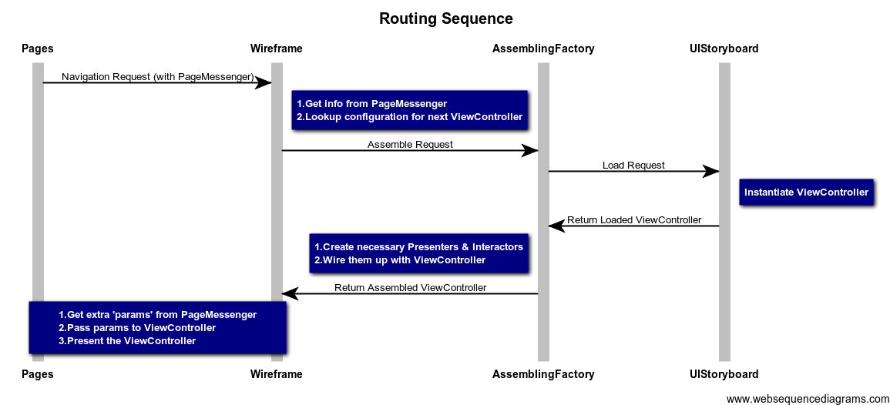
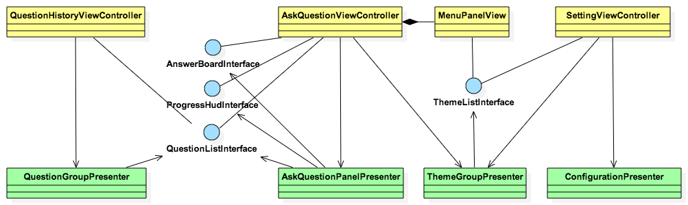

## What's this project?

This is a project for demonstrating the VIPER(View-Interactor-Presenter-Entity-Routing), which is an approach to iOS application architecture. 
Also, it is a variant of VIPER that integrated with my own understanding of the concept and some practical experience, which I think will make it more flexible and suitable for different kinds of projects.

The idea was inspired from [HERE](http://www.objc.io/issue-13/viper.html)

## Routing

It takes care of all the navigation logic in the application, we describe which screens are shown in which order here. 
Also, it takes the responsibility of creating all the view controllers, presenters and interactors, and wire them up.
It is like playing a glue role in the application, putting every picecs together so others should only need to worry about their own jobs.

Here is a sequence diagram of Routing which will help you to get an overview of it and know how it works:

## View - Presenter

View, as its name, displays infomation/content on the screen, and deals with the user interactions. Most time in iOS, views mean view controllers, but some time we need to create our own view widgets(like for reuse purpose, etc), you can find an example in the Demo project: MenuPanelView. View holds references of presenters, it will relays user input back to the presenters, as well as view controller life cycle callbacks(like viewDidLoad:), so that presenter could get correct content to display based on view logic.

Presenter prepares content for views to display, and reacts to user inputs. It does not directly talk to views, instead, it talks to view interfaces(@protocol), so that one presenter could be reused in different views, as long as views conform to needed view interfaces.

Here is a UML map of some views and presenters in this Demo project, we could get a general picture of how they are related:

A typical work flow between views and presenters would be like this:

  1. View A is loaded and going to be present
  2. View A reports (viewWillAppear:) to Presenter X
  3. Presenter X find data for displaying
  4. Presenter X call display content via ViewInterface(which View A conforms to, or some subview of A comforms to)
  5. User click a button on View A
  6. View A relays click action to Presenter Y as a specific intend(with or without extra info)
  7. Presneter Y deals with this action based on view logic

## Interactor - Presenter

Interactor contains the business logic as specified by a use case. Actually we don't need to stick to the name, i.e. "Interactor", we could use "Service", "Manage" and the like, as long as it plays the part of dealing with logic, it should be independent of any UI. Also, inside the interactor, it could call other services(like send API calls to server) to finish the logic. Each Presenter could contains 0...* interactors. The idea of interactor is to isolate the business logic code from others, then it could be reused, optimized and generalized.

## Models, DTO

As the requirements grows in applications, CoreData has already become an indispensable part of the app. But usually we don't want to expose Model instances to Views as they contains persistent status, we use DTOs(Data Transfer Objects) to play the data passer roles. Here in the Demo project you can see how it was used.

## Tests

One good part of VIPER architecture is it decouples UI, view logic, bussiness logic in code, so it would be more easier for developers to write unit tests. In this Demo project, I added testcase examples for every part of this architecture, so we could see how easier to test each part, also it demonstrates how to test each part of the code, as well as dealing with block arguments, testing asynchronous code.

## 3rd Party Libraries

In this Demo project, we are using MagicalRecord to make fetching for CoreData more easier, and OCMock to help write unit tests. (they are both my personally recommended tools)

